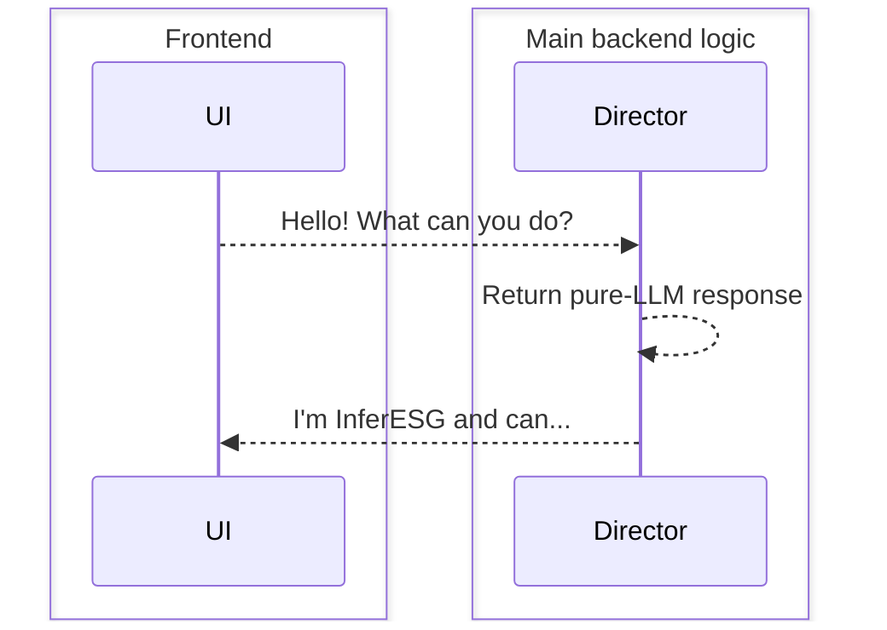

## "Hello! What can you do?"

I am a user who is asking about the bots capabilities

```mermaid
sequenceDiagram
    box Frontend
    participant UI
    end
    box Main backend logic
    participant Director
    end
    UI -->> Director: Hello! What can you do?
    Director -->> Director: Return pure-LLM response
    Director -->> UI: I'm InferESG and can...
```
